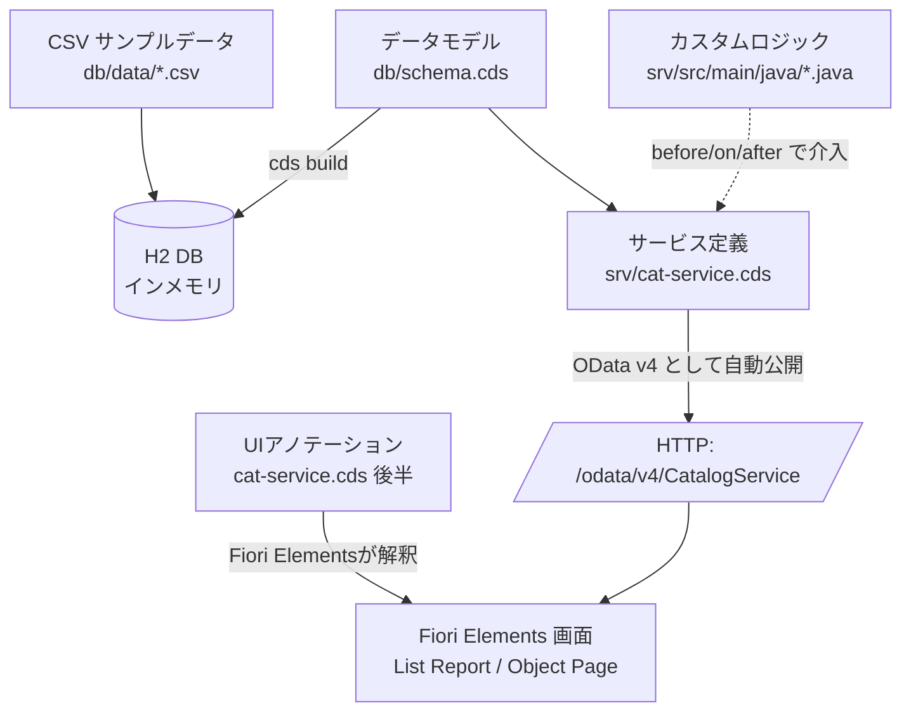

# 00. 全体像 ― CAP / Fiori Elements / UI5 / HANA の関係

## この環境で何を学ぶか

現場のバックエンドは **CAP Java（Spring Boot / Maven）** です。
この学習環境も同じ CAP Java 構成にしてあり、以下の「縦のつながり」を体で理解するのが目的です。

## 登場人物の役割

| 用語 | 何者か |
|---|---|
| **CAP** | SAP のアプリ開発フレームワーク。「モデル→サービス→DB」を .cds で宣言的に作る。実行系に **Node.js版** と **Java版** がある。**現場はJava版** |
| **CDS(.cds)** | データモデル・サービス・UIアノテーションを書く共通言語。**Node/Java どちらでも同一** |
| **OData v4** | CAP が自動生成する Web API の形式。URLでデータを読み書きできる |
| **Fiori Elements** | アノテーションから標準画面を自動生成する仕組み。画面を手書きしない |
| **SAP UI5** | Fiori 画面が動く土台のJSフレームワーク。フロントは Node/Java で共通 |
| **HANA** | SAP の本番DB。学習では代わりに H2（インメモリ）を使う |
| **Spring Boot** | CAP Java が乗る Java の実行基盤。`cds watch` 起動なら 4004 でサーバが立つ |
| **Maven** | Java の依存解決・ビルド・起動ツール（`pom.xml`）。現場と同じ |

## CAP Node.js 版との違い（要点だけ）

この環境は以前 Node.js 版で作っていました。現場に合わせて Java 版へ作り直しています。
**変わらない中核** と **変わる部分** を区別して覚えると効率的です。

| | 変わらない（言語非依存） | 変わる |
|---|---|---|
| モデル `db/schema.cds` | ✅ 同一 | |
| サービス `srv/cat-service.cds` | ✅ 同一 | |
| UIアノテーション | ✅ 同一 | |
| Fiori Elements / UI5 | ✅ 同一 | |
| カスタムロジック | | 🔁 JS → **Java(イベントハンドラ)** |
| ビルド/依存/起動 | | 🔧 npm → **Maven** |
| 開発時のポート | | ✅ どちらも **4004**（`cds watch` 起動時） |
| 学習用DB | | 🔧 SQLite → **H2**（考え方は同じ） |

→ 次章 [01. devcontainer の仕組み](01-開発コンテナ.md)
