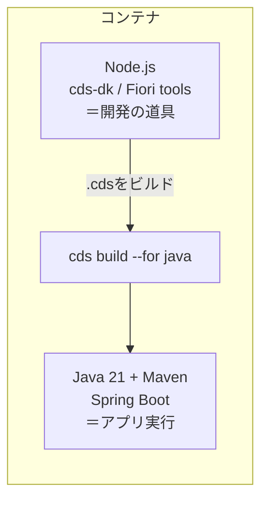

# 01. devcontainer の仕組み（Java + Maven + Node の同居）

## devcontainer とは

「開発に必要なツールが最初から全部入った使い捨ての Linux 環境」を、
設定ファイルから毎回同じように作る仕組みです。Mac 本体には何も入れません。

- **`.devcontainer/Dockerfile`** … 土台のイメージと、追加インストールを書く
- **`.devcontainer/devcontainer.json`** … VS Code への指示（拡張・ポート・features 等）

## なぜ Node と Java が両方入っているのか

現場は CAP **Java** ですが、この環境には Node.js も入っています。理由：

- **Java + Maven** … アプリ本体(Spring Boot)を動かす／ビルドする。**実行系の主役**
- **Node.js** … CAP の開発ツール(`cds` コマンド, Fiori 画面ジェネレータ)が Node 製。
  これらは**開発時の道具**で、動かしたアプリ(.jar)の実行には関与しません。



## 各設定の意味（このプロジェクトの実物）

### Dockerfile
- ベース：`javascript-node:20`（Node と cds-dk / Fiori tools を入れる土台）
- `npm install -g` で `@sap/cds-dk`（cdsコマンド）, `@ui5/cli`, `@sap/generator-fiori`, `mbt` を導入

### devcontainer.json
- **`features` で Java 21 + Maven を追加**（`ghcr.io/devcontainers/features/java`）。
  Dockerfile に apt で書く代わりに、features を使うと宣言的で綺麗です。
- **`forwardPorts: [4004, 4005, 8082, 8083]`** …
  バックエンドは A-cap=4004 / B-cap=4005、フロントは A-ui5=8082 / B-ui5=8083。
  UI5 のポートは各 `ui5.yaml` の `server.settings.httpPort` で固定しています。
- **`mounts`** … `node_modules` を高速ボリュームへ（mac の bind mount 遅延対策）。
- **`extensions`** … CDS 言語、Fiori tools、**Java 拡張パック**、Spring Boot 支援を自動導入。
- **`postCreateCommand: "java -version; mvn -v; cds -v"`** … 作成直後に版を表示して確認。

## よく使う確認コマンド

```bash
java -version   # openjdk 21 が出ればOK
mvn -v          # Apache Maven が出ればOK
cds -v          # @sap/cds-dk のバージョンが出ればOK
```

→ 次章 [02. CAP Java の基本](02-CAP-Javaの基本.md)
