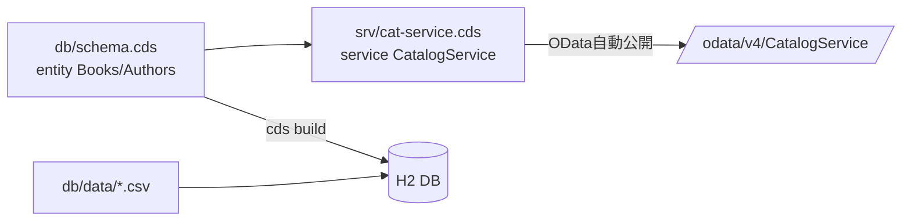
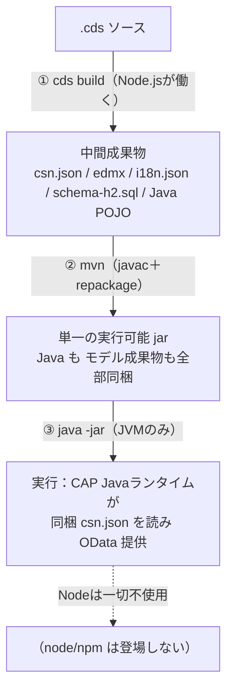

# 02. CAP Java の基本 ― モデル → サービス → DB とプロジェクト構成

## 3つの登場ファイル

CAP の中核は「宣言的に書く .cds」です。実行系が Java でも、ここは同じです。

1. **データモデル** `db/schema.cds` … テーブルの形（entity）を定義
2. **サービス定義** `srv/cat-service.cds` … 外に公開する窓口（projection）＋UIアノテーション
3. **サンプルデータ** `db/data/*.csv` … 起動時に DB へ投入する初期データ



## CAP Java プロジェクトの構成（Node版との違い）

`cds init --add java` で作られる Maven プロジェクトです。

```
fiori-study/
├── pom.xml                     … ★親 Maven 設定（全体をまとめる）
├── srv/
│   ├── pom.xml                 … ★srv モジュールの Maven 設定（依存や cds-maven-plugin）
│   ├── src/main/java/
│   │   └── customer/fiori_study/Application.java  … ★Spring Boot 起動クラス
│   └── src/main/resources/
│       ├── application.yaml     … Spring/CAP の設定（DBプロファイル等）
│       └── (schema-h2.sql 等)   … ビルドで生成されるDDL
├── db/
│   ├── schema.cds              … データモデル（Node版と同一）
│   └── data/*.csv              … サンプルデータ
├── app/                        … Fiori アプリ（GUIで生成）
└── package.json                … cds-dk（開発ツール）用
```

| Node版 | Java版（このプロジェクト） |
|---|---|
| `package.json`（実行依存） | **`pom.xml`**（実行依存は Maven） |
| ロジックは `srv/*.js` | ロジックは **`srv/src/main/java/**/*.java`** |
| DB=SQLite | DB=**H2** |
| `cds watch` で 4004 | A-cap は **4004**、B-cap は **4005**（各 `application.yaml` で固定） |

## ビルド時に何が起きるか（cds-maven-plugin）

`srv/pom.xml` の `cds-maven-plugin` が、ビルド時に自動で：

1. `cds build --for java` … `.cds` を CSN(内部形式)/edmx へコンパイル
2. `cds deploy --to h2 …` … H2 用の DDL(`schema-h2.sql`) を生成
3. **POJO 生成** … `cds.gen` パッケージに、Java から型安全に扱うクラスを生成
   （例：`Books`, `Authors` インターフェイス。カスタムロジックで使う）

つまり **SQL も Java の入れ物クラスも手書き不要**。`.cds` が唯一の真実(single source of truth)です。

## なぜ Maven と npm が同居するのか（重複ではない）

CAP Java プロジェクトには `pom.xml`(Maven) と `package.json`(npm) の両方があり、
「パッケージマネージャが重複では？」と見えます。しかし**役割が違う2層**で、被りません。

| | Maven / Java | npm / Node |
|---|---|---|
| 何を管理 | **アプリ本体**の依存（Spring Boot、cds-services の Javaライブラリ） | **CDS モデルの依存**（`.cds` コンパイラ `@sap/cds-dk`、再利用モデル） |
| いつ使う | ビルド **と** 実行（`.jar` を動かす） | **ビルド時だけ**。実行時は不使用 |

理由：`.cds` をコンパイルする `cds` コマンド（＝ `@sap/cds`）が **Node.js 製**だからです。
Java 側にそのコンパイラは無いので、ビルド時だけ Node/npm を借ります。実際
`schema.cds` の `using { cuid, managed } from '@sap/cds/common';` の中身は npm パッケージ
`@sap/cds` に同梱されており、`npm ci` で取得しないと `cds build` が解決できません。

しかも `srv/pom.xml` の `cds-maven-plugin` が、Maven ビルド中に**自動で** Node を落として
`npm ci` → `cds build` を回します。だから通常は「`mvn` を叩けば裏で npm も回る」だけで、
npm を意識せず済みます（`package.json` は `@sap/cds-dk` だけの最小構成）。

## コンパイル後は「1個の jar」だけが動く（実行時に Node は不使用）

Node が関わるのは**ビルド時だけ**。実行時は **JVM が jar を動かすだけ**で、両者は
「実行時の呼び出し関係」ではなく「**ビルド時の受け渡し（バトンタッチ）**」でつながります。



- `cds build` は `.cds` を **JSON(csn.json) / XML(edmx) / Java(cds.gen)** に変換するだけ。
  変換が終われば Node は退場（生成物は「ただのファイル」）。
- `mvn` がそれらと Java コード・ランタイムを **1個の実行可能 jar**（`srv/target/*-exec.jar`）に梱包。
  jar の中に `.cds` そのものや Node ランタイムは**入らない**（入るのは変換後の成果物だけ）。
- 実行時は JVM が jar を起動し、CAP Java ランタイムが同梱の **`csn.json`（モデルのJSON表現）**
  を読んで OData を提供。**Node プロセスは1つも動かない**。

まとめ：**Node＝ビルド時の翻訳者、実行時は純 Java(JVM)**。`csn.json` が
「Node が作った成果を Java が引き継ぐ橋渡しフォーマット」になっている、と捉えると綺麗です。

## サンプルデータ CSV の書き方

- ファイル名は `<namespace>-<Entity>.csv`
  例：`db/data/fiori.study-Books.csv`
- 1行目がヘッダ（列名）。関連は外部キー列名 `author_ID` で指定。
- 主キー `ID` は cuid(UUID)。CSV では UUID 文字列を書きます。

→ 次章 [03. Fiori Elements 画面を作る](03-Fiori画面.md)
