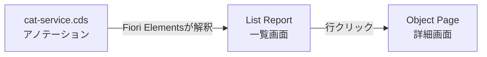

# 03. Fiori Elements 画面をGUIで作る

> ⚠️ 現在このリポジトリは**フロントとバックを分離した独立プロジェクト構成**です
> （→ [07-マルチプロジェクト構成.md](07-マルチプロジェクト構成.md)）。
> 本章は「Fiori Elements の考え方・GUI 生成手順」を学ぶ資料として読んでください。
> 新規に画面を作る場合、データソースは「ローカルCAP」ではなく **OData URL**
> （例：`http://localhost:4004/odata/v4/CatalogService`）を選ぶと、生成時点から
> バックエンドと疎結合になり、独立プロジェクト構成に馴染みます。

> Fiori Elements（フロント）は Node/Java どちらのバックエンドでも同じです。
> この章の手順は CAP Java プロジェクトでもそのまま通用します。

## まず理解すべき要点

- Fiori Elements は**画面を手書きしない**。CAPのアノテーション(注釈)から自動生成する。
- 新規作成は実案件と同じく**GUIウィザード**から行える。
- 生成後の追加・編集も **Page Map** というGUIエディタでできる。

## 「アノテーション駆動」とは

「どの項目を一覧に出すか」等を*注釈*で宣言すると、標準画面
（一覧＝List Report、詳細＝Object Page）を**自動で**作ります。
その注釈は [`../srv/cat-service.cds`](../srv/cat-service.cds) の後半にあります。例：

```cds
annotate CatalogService.Books with @(
  UI.LineItem: [                            // ← 一覧に出す列
    { Value: title,       Label: '書名' },
    { Value: author.name, Label: '著者' },
    { Value: stock,       Label: '在庫' },
    { Value: price,       Label: '価格' }
  ]
);
```

`UI.LineItem` を編集すれば一覧の列が変わります。**画面コードは触りません。**

## GUIで新規アプリを作る手順

> 前提：VS Code Desktop で「Reopen in Container」済み。
> かつ別ターミナルで `cds watch` を起動して CAP Java が動いていること。

1. コマンドパレット（`Cmd+Shift+P`）を開く
2. **`Fiori: Open Application Generator`** を選ぶ
3. ウィザードで選択：

   | 項目 | 選ぶもの |
   |---|---|
   | Template | **List Report Object Page** |
   | Data source | **Use a Local CAP Project** → 本プロジェクト |
   | OData service | **CatalogService** |
   | Main entity | **Books** |

4. Module name を `bookshop` などにして **Finish**
5. `app/bookshop/` にアプリが生成される

生成後、`cds watch` を再起動すれば http://localhost:4004 にアプリが載ります。

## 画面を後から編集する（Page Map / Guided Development）

- コマンドパレット → **`Fiori: Open Page Map`**
  - List Report ⇄ Object Page のつながりを図で編集、サブ画面追加
- コマンドパレット → **`Guided Development`**
  - 「列を追加」「検索フィールドを追加」等をガイド付きで実施
  - 実体は `annotate` の追記。GUIが `.cds` に書き込む



## CLIでの生成（GUIが不調なときの保険）

```bash
npx yo @sap/fiori     # 対話式。GUIと同じ選択肢をターミナルで答える
```

## トラブルシューティング

- ウィザードに CAP サービスが出ない → `cds watch` が動いているか、
  `srv/cat-service.cds` が保存済みか確認。
- 拡張が見つからない → devcontainer に Fiori tools が入っているか（[01章](01-開発コンテナ.md)）、
  VS Code Desktop で開いているか（ブラウザ版では一部GUIが動きません）。

→ 次章 [04. 起動・確認・デバッグ](04-起動とデバッグ.md)
