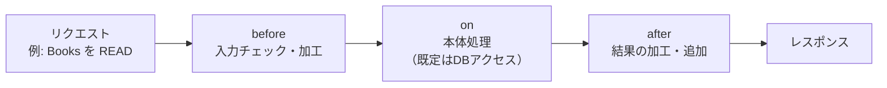

# 06. カスタムロジックを Java（イベントハンドラ）で書く

ここが CAP **Node.js 版と一番違う**ところで、かつ**現場で実際にコードを書く**部分です。
モデルやアノテーションは宣言で済みますが、「保存前に在庫チェック」「金額を計算して足す」
といった独自処理は Java で書きます。

## 考え方：イベントハンドラ（before / on / after）

CAP のサービスは、リクエストを **イベント**として処理します。
その前後に自分の処理を差し込むのが「ハンドラ」です。この考え方は Node/Java 共通です。



| フック | 使いどころ |
|---|---|
| `@Before` | 入力バリデーション、必須値の補完 |
| `@On` | 独自の本体処理（既定動作を置き換える。カスタムアクション等） |
| `@After` | 取得結果に計算値を足す、整形する |

## 実例：一覧取得後に「在庫僅少」フラグを足す

`srv/src/main/java/customer/fiori_study/handlers/` に置くイメージ（要 import 調整）。

```java
package customer.fiori_study.handlers;

import org.springframework.stereotype.Component;
import com.sap.cds.services.handler.EventHandler;
import com.sap.cds.services.handler.annotations.After;
import com.sap.cds.services.handler.annotations.ServiceName;

// cds.gen パッケージのクラスは cds build 時に .cds から自動生成される
import cds.gen.catalogservice.Books;
import cds.gen.catalogservice.CatalogService_;

import java.util.List;

@Component                              // Spring に「これは部品」と認識させる
@ServiceName(CatalogService_.CDS_NAME)  // どのサービス向けのハンドラか
public class BooksHandler implements EventHandler {

  // READ の後に呼ばれる。取得した Books 一覧に対して処理できる。
  @After(event = "READ")
  public void addLowStockHint(List<Books> books) {
    for (Books b : books) {
      Integer stock = b.getStock();
      if (stock != null && stock < 10) {
        // 説明文の先頭に注意書きを足す（例）
        b.setDescr("【在庫僅少】" + (b.getDescr() == null ? "" : b.getDescr()));
      }
    }
  }
}
```

### Node版と見比べる（同じことを JS で書くと）

```js
// CAP Node.js の場合（参考）
module.exports = (srv) => {
  srv.after('READ', 'Books', (books) => {
    for (const b of [].concat(books)) {
      if (b.stock != null && b.stock < 10) {
        b.descr = '【在庫僅少】' + (b.descr ?? '');
      }
    }
  });
};
```

→ **考え方（before/on/after, 対象エンティティ）は同一**。構文と型付けが変わるだけ、と分かります。

## 開発の流れ

1. `.cds` を保存すると `cds build` が `cds.gen` に POJO を再生成（`Books` 等）
2. Java でハンドラを書く（上記）
3. `cds watch` が再ビルド・再起動 → 4004 で動作確認
4. ブレークポイントを張ってステップデバッグ（→[04章](04-起動とデバッグ.md)）

## 本番(HANA / BTP)へ広げる道筋（さわり）

- `srv/pom.xml` に HANA 用の依存（`cds-feature-hana`）を足す
- `application.yaml` に本番プロファイルを追加し、HANA を指す
- `mbt build` で MTA(.mtar) を作り、Cloud Foundry(BTP) へ `cf deploy`
- DB は HANA Cloud を割り当て、`cds deploy` でスキーマ反映

> 詳細は段階が来たら別途。まずは「H2 で作る → Java でロジック → デバッグ」の
> ループを体に入れるのが、現場（CAP Java）への最短ルートです。
