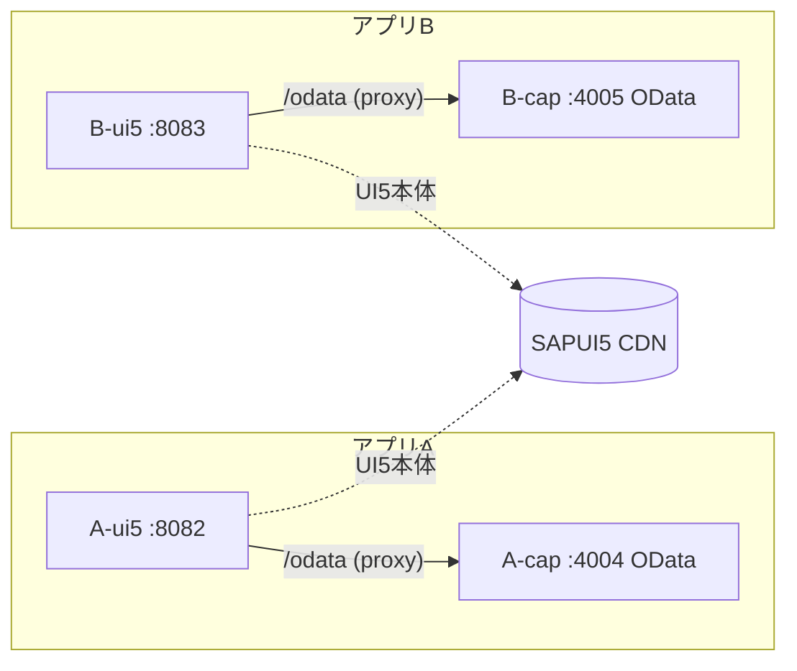

# 07. マルチプロジェクト構成（現場準拠：フロントとバックを分離）

## なぜこの構成にするか
現場は「アプリごとに CAP と UI5 が**別リポジトリ**・各自 i18n・**独立ビルド/デプロイ**」。
この学習環境も、密結合していた1つの CAP モノレポを解体し、**独立プロジェクトの集合**に
作り替えました（学習環境なので、別リポジトリの代わりに**フォルダ分離**で再現）。

```
fiori-study/                （ワークスペース＝入れ物。devcontainer と docs を共有）
├── A-cap/   … bookshop バックエンド（独立 CAP Java：OData を 4004 で提供）
├── A-ui5/   … bookshop フロント    （独立 UI5：8082。/odata を A-cap へ proxy）
├── B-cap/   … movies   バックエンド（独立 CAP Java：OData を 4005 で提供）
└── B-ui5/   … movies   フロント    （独立 UI5：8083。/odata を B-cap へ proxy）
```

- A と B は**無関係の別ドメイン**（本屋／映画）。DB も別。互いに依存しません。
- 各 CAP は自前の `db/ srv/ pom.xml _i18n/`、各 UI5 は自前の `webapp/ ui5.yaml i18n/` を持つ。

## 密結合をどう解いたか（ここが肝）
分離前、UI5 は `annotations.cds` で `../../srv/cat-service` と**ファイル参照**していました。
これだと UI5 は CAP のソースツリーが隣に無いと成立せず、独立できません。

**解いた方法：UI5 は CAP のファイルを一切見ず、実行時に OData(HTTP) だけで繋ぐ。**
- 画面用アノテーション（LineItem・ラベル・ValueList 等）は**すべて CAP 側**へ集約。
  UI5 はそれを `$metadata` 経由で受け取るだけ（`manifest.json` の dataSource は URL のみ）。
- 開発時は UI5 の `ui5.yaml` の `fiori-tools-proxy` が `/odata` を対応バックエンドへ転送。
- 本番はこの proxy の代わりに **destination / approuter** が同じ役割を担う。



## 起動手順（各プロジェクトを独立して起動）
ターミナルを分けて、必要なアプリだけ起動します。

```bash
# アプリA
cd A-cap/srv && mvn spring-boot:run       # → http://localhost:4004 (OData)
cd A-ui5     && npm install && npm start   # → http://localhost:8082 (画面)

# アプリB
cd B-cap/srv && mvn spring-boot:run       # → http://localhost:4005 (OData)
cd B-ui5     && npm install && npm start   # → http://localhost:8083 (画面)
```
A だけ使うなら A-cap と A-ui5 の2つを起動すれば十分。B は無関係に動きます。

## ビルド/デプロイは「一本ずつ」独立して行う
**はい。各プロジェクトを個別にビルド・デプロイします。それが分離の目的です。**

| プロジェクト | ビルド | デプロイ先（本番の例） |
|---|---|---|
| A-cap / B-cap | `mvn clean install`（`.jar` 生成） | BTP / Cloud Foundry（`cf push` や MTA）。DBは HANA |
| A-ui5 / B-ui5 | `ui5 build`（静的資産生成） | HTML5 アプリ repo / Launchpad |

- フロントとバックは**ビルド時には繋がりません**。実行時に destination/approuter（本番）
  や proxy（開発）で接続します。
- よって**リリース単位・バージョンが独立**。「UI5 の文言だけ直して UI5 だけ再デプロイ」
  「バックの計算ロジックだけ直して CAP だけ再デプロイ」が互いに影響なくできます。
  これが現場でアプリごと・層ごとにリポジトリを分ける最大の利点です。

## DB の持ち方と、サービス間でデータを共有する定石

### 各アプリが自分のスキーマを持つ（database per service）
A も B も**自分専用のスキーマ／DB**を持ち、独立してデプロイします。これは
マイクロサービスの原則「database per service」で、BTP でも標準です。
- 本番 HANA では各サービスが自分の **HDI コンテナ（隔離スキーマ＋独自デプロイ寿命）** を持つ。
- 「全体で1個の共有DB」は密結合を生むため、むしろ避ける方向が主流。

> ★注意：ローカル(H2 インメモリ)は起動毎に作り直されますが、**本番 HANA は永続**で、
> デプロイは全消しでなく**差分マイグレーション**（列追加等）です。「デプロイ＝作り直し」は
> ローカル特有の挙動です。

### 他サービスのデータが欲しいとき ―― テーブルではなく「API」で共有
別サービスのテーブルを**直接読みにいく設計は避けます**（参照先の内部が変わると壊れる密結合）。
CAP の `service`（projection）が「安定した契約の境界」で、ここ越しに共有します。

```
悪い例（密結合・非推奨）              良い例（疎結合・推奨）
B ── 直接SQL ─► A のテーブル          B ── OData/HTTP ─► A の service ─► A のテーブル
   Aの内部変更で即壊れる                Aは内部テーブルを自由に変えられる（APIを保てばBは無傷）
```

| パターン | 内容 | いつ使う |
|---|---|---|
| **① サービス連携（推奨）** | 消費側が相手の OData サービスを消費（CAP の *remote service*：`cds import` で API を取り込み `using` で参照） | 別ドメイン同士の通常のデータ連携 |
| **② 共有モデルパッケージ** | 共通エンティティを1つの CDS パッケージ(npm)に定義し、双方が `using from '@org/common'` で参照。**定義は1箇所** | 同じマスタ定義を複数アプリで使いたい（一元管理したい）時 |
| **③ HDIクロスコンテナ参照** | HANA でコンテナ間に synonym/grant を張り特定テーブルを共有 | DBレベル共有が必要な限定ケース（密結合を承知で） |

- 「スキーマが1箇所じゃなくて管理しにくい」→ 共通で使う定義は **②** で唯一の所有者を決める。
  **同じエンティティを二重定義するのはアンチパターン**。
- 参照先が内部テーブルを変えても、**公開している projection の形さえ保てば参照元は無傷**。
  公開APIそのものを変える時だけ、REST 依存と同様に**バージョニング・後方互換**の規律が要る。

### いつ「1スキーマ」にまとめるか
- 2つのアプリが**同じ業務ドメイン(bounded context)**なら、そもそも分けず **1つの CAP＋1スキーマ**。
- 分割の線引きは「**データの結びつきの強さ**」で決める。強く絡むデータ（注文と在庫など）は
  同じサービス＝同じスキーマに置く。今回 A(本屋)/B(映画) を分けたのは別ドメインだから。

## 将来：本当に別リポジトリにするには（任意）
フォルダ分離のままで学習は十分ですが、現場に完全一致させるなら各フォルダで:
```bash
cd A-cap && git init && git add -A && git commit -m "init A-cap"
# A-ui5, B-cap, B-ui5 も同様
```
とすれば、4つの独立リポジトリになります。
