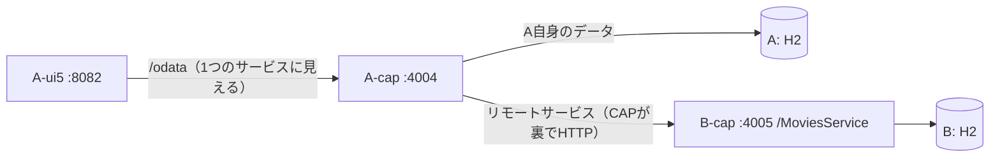

# 09. サービス間連携サンプル（A が B のデータを取り込んで一覧から遷移する）

## この章のゴール
アプリA（本屋）の本一覧に、**関連映画を開くためのリンク列**を出します。
具体的には：**Book の一覧に「関連情報」列を追加**し、その文字列をクリックすると
**別アプリB（映画）の詳細ページ**へ遷移します。

- A と B は別サービス・別DB（独立）。**B のテーブルは直接触りません**。
- A-cap が **B の OData API を"リモートサービス"として消費**し、A-ui5 には1つのサービス
  （A-cap）として見せます。これが [07 章](07-マルチプロジェクト構成.md)の
  「テーブルではなく API で共有」の実践です。

## あなたの理解の確認（データの流れ）
「A-CAP が B-CAP のエンドポイントを叩き、戻りの OData を A-ui5 に返す」——**その通り**です。
ただし CAP では手書きの HTTP 呼び出しは不要で、**リモートサービス機能**が裏で HTTP します。


A-ui5 は **A-cap だけ**を見ます。B の存在はフロントからは隠れます（疎結合）。

---

## 全体設計（なぜこの形か＝ベストプラクティス）
- **フロントは1メインサービス**にひも付くのが Fiori Elements の原則。だから B を
  フロントで直接持たず、**A-cap 側で束ねて（federation）**1サービスに見せる。
- A-cap は B を **remote service** として取り込み、`Movies` を「永続化しない外部エンティティ」
  として自分のサービスに投影（projection）。読み取り時に CAP が B へ委譲。
- Book → 関連映画は、A が持つ `relatedMovie_ID`（Bの映画ID）で結びつける。
  **DBの外部キーではなく“IDの参照”**（映画の実体は B の所有だから）。

---

## 実装ステップ

### ✅ Step 0（実装済み）：Book に関連映画IDを持たせる
- `A-cap/db/schema.cds`：`Books` に `relatedMovie_ID : String(36);` を追加済み。
- `A-cap/db/data/fiori.study-Books.csv`：一部の本に B の映画IDを設定済み
  （例：吾輩は猫である→七人の侍、人間失格→千と千尋、銀河鉄道の夜→羅生門）。

> ★以下の Step 1–2 は、実際に動いた**確定版の構成**です（CAP Java 3.10 / cds4j 3.10.1 で検証）。
> `cds import` を使わず、B のモデルが小さいので外部定義を手書きしています。

### Step 1：B の API 定義を A-cap に用意する（外部モデル）
`A-cap/srv/external/MoviesService.cds` を手書きで作成（`cds import` の生成物に相当）。
`@cds.external`＝Aは配信せず外部にある印、`@cds.persistence.skip`＝AのDBに表を作らない。
```cds
@cds.external
service MoviesService {
  @cds.persistence.skip
  @readonly
  entity Movies {
    key ID     : UUID;
        createdAt  : Timestamp;  createdBy  : String;
        modifiedAt : Timestamp;  modifiedBy : String;
        title  : String;  year : Integer;  genre : String;
        rating : Decimal(2, 1);  descr : String;
  }
}
```
> B を正規にインポートしたい場合は、B を一度起動して edmx を生成し
> `cds import ../B-cap/srv/src/main/resources/edmx/odata/v4/MoviesService.xml --as cds`
> でも同じ外部モデルを生成できます（学習では手書きで十分）。

### Step 2：リモート接続を「4点セット」で構成する
CAP Java でリモート OData を消費するには、次の**4つが揃って初めて動きます**。
1つでも欠けると（今回ハマったように）各層で別々のエラーになります。

**(a) 依存：HTTP 実行機能を足す** ― `A-cap/srv/pom.xml`
```xml
<dependency>
  <groupId>com.sap.cds</groupId>
  <artifactId>cds-feature-remote-odata</artifactId>
  <scope>runtime</scope>
</dependency>
```
> これが無いと「`No ON handler completed (service 'MoviesService')`」＝リモートに
> HTTP を実行するハンドラが付かない。

**(b) リモートサービス宣言** ― `A-cap/srv/src/main/resources/application.yaml`
```yaml
cds:
  remote.services:
    MoviesService:
      type: "odata-v4"
      model: "MoviesService"   # ★ファイルパスではなく「CDSサービス名」
```
> `model` にパス(`srv/external/...`)を書くと「`Cannot find service`」になる。サービス名を書く。

**(c) 接続先(destination) を渡す** ― `A-cap/srv/pom.xml` の spring-boot-maven-plugin
```xml
<configuration>
  <skip>false</skip>
  <environmentVariables>
    <destinations>[{"name":"MoviesService","url":"http://localhost:4005/odata/v4"}]</destinations>
  </environmentVariables>
</configuration>
```
> ・CAP Java は接続先を SAP Cloud SDK の **destination** として解決し、その既定ローダーは
>   **OS 環境変数 `destinations`** を読む。ここで渡すと `mvn spring-boot:run` だけで動く（export 不要）。
> ・destination 名は、宣言したリモートサービス名と同じ **`MoviesService`**。
> ・url は **`/odata/v4` まで**。CAP がこの後ろに `/MoviesService/Movies` を足すので、
>   ここでサービス名まで書くと二重になり **404**。
> ・`default-env.json` は SDK の destination には**読まれない**（ハマりポイント）。
> ・本番(BTP)ではこの環境変数は使わず、destination サービスが同名で注入する（ソースは不変）。

**(d) 転送ハンドラ** ― `A-cap/srv/src/main/java/customer/fiori_study/MoviesForwardHandler.java`
公開した投影(下記 Step 3 の `CatalogService.Movies`)の READ を、リモートへ転送する。
```java
@Component
@ServiceName("CatalogService")
public class MoviesForwardHandler implements EventHandler {
  @Autowired @Qualifier("MoviesService")
  private CqnService moviesService;

  @On(event = CqnService.EVENT_READ, entity = "CatalogService.Movies")
  public Result readMovies(CdsReadEventContext context) {
    return moviesService.run(context.getCqn());   // ★void+setResult ではなく return（完了扱いになる）
  }
}
```
> `void` で `context.setResult(...)` だと「`No ON handler completed`」。**`Result` を return** する。

> 追加で `BooksLinkHandler.java` を置き、Books の READ 後に `relatedMovieTitle` と `relatedMovieUrl` を補います。
> これで `UI.DataFieldWithUrl` の `Url` に渡す値がそろいます。

> ★以下は「一覧の関連情報列をリンクにする」構成に合わせて整理した説明です。
> 本詳細ページに映画セクションは出さず、一覧から B 側へ飛ぶ導線を主役にします。

### Step 3：Book に関連付け＋リンク用カラムを追加（`A-cap/srv/mashup.cds`）
Step 1–2 の `mashup.cds`（Movies 投影）に、以下を追記:
```cds
// Book → 関連映画。relatedMovie_ID(本が持つ映画ID) と Movies.ID を突き合わせる。
// これで Books の1行から関連映画の title を参照できる。
extend projection CatalogService.Books with {
  relatedMovie : Association to CatalogService.Movies
                   on relatedMovie.ID = relatedMovie_ID,
  // 画面専用のタイトル/URLカラム。DBには保存せず、READ後にJavaで補う。
  virtual null as relatedMovieTitle : String(200),
  virtual null as relatedMovieUrl : String(500)
}
```
> `relatedMovie` は API 上の関連、`relatedMovieTitle` は一覧に見せる文字、`relatedMovieUrl` は「B 側へ飛ぶためのリンク先」です。
> 役割を分けることで、一覧のセルをリンクにしやすくしています。

> 注意：`$expand=relatedMovie` は OData 上の関連としては公開されますが、今回の CAP Java 構成では
> リモート越しに自動展開されず `relatedMovie: null` になりました。そのため、画面表示用の映画名は
> `BooksLinkHandler.java` で B から取得して `relatedMovieTitle` に詰めます。
> また Fiori Elements の一覧は `$select` で必要列だけを読むため、レスポンス行に `relatedMovie_ID` が
> 含まれないことがあります。`BooksLinkHandler.java` は返却済みの `ID` から A の DB を引き直し、
> `relatedMovie_ID` を解決してから B の映画タイトルを取得します。

### Step 4：Book 一覧に「関連情報」リンク列を追加（`A-cap/srv/cat-service.cds`）
`UI.LineItem` に `UI.DataFieldWithUrl` を追加し、`relatedMovieTitle` を表示文字に、`relatedMovieUrl`
を遷移先にします。
```cds
UI.LineItem: [
  { Value: title,       Label: '{i18n>book_title}' },
  { Value: author.name, Label: '{i18n>book_author}' },
  {
    $Type : 'UI.DataFieldWithUrl',
    Value : relatedMovieTitle,
    Url   : relatedMovieUrl,
    Label : '{i18n>book_relatedMovie}'
  }
]
```
これで **本一覧の行から B 側の映画詳細へ遷移**できます。`relatedMovie_ID` を持つ本
（吾輩は猫である→七人の侍 等）でリンクが表示されます。

> 補足：この構成では `CatalogService.Movies` を A 側で別ページ表示する必要はありません。
> B 側の Object Page へ直接飛ばすので、A 側は一覧の導線に集中します。

### Step 5：起動と確認
```bash
# B（先に起動しておく：A がここへ問い合わせる）
cd /workspaces/fiori-study/B-cap/srv && mvn spring-boot:run       # → 4005

# A（B を消費する）
cd /workspaces/fiori-study/A-cap/srv && mvn spring-boot:run       # → 4004

# フロント
cd /workspaces/fiori-study/A-ui5 && npm start                     # → 8082
cd /workspaces/fiori-study/B-ui5 && npm start                     # → 8083
```
確認：
1. `http://localhost:4004/odata/v4/CatalogService/Movies` → B の映画が A 経由で返る
   （A が B に問い合わせている証拠）。
2. `http://localhost:4004/odata/v4/CatalogService/Books` → `relatedMovieTitle` と `relatedMovieUrl` が入る。
   `relatedMovieUrl` は B-ui5 の Object Page ルートに合わせて `#/Movies(ID=<uuid>)` 形式にする。
3. `http://localhost:8082` → 本一覧の「関連情報」リンク → クリックで映画詳細へ。

---

## 現在の状態（2026-07-05 時点）
- **Step 0〜2**：`GET /odata/v4/CatalogService/Movies` で B の映画が A 経由で返る（連携疎通・確認済み）。
- **関連付け**：`?$expand=relatedMovie` は `relatedMovie: null` になるため、一覧表示は `relatedMovieTitle` を Java 後処理で補う構成。
- **画面**：本一覧に「関連情報」リンク列を出し、そこから B の映画詳細へ飛ぶ構成に切り替え済み。

## ハマりどころ早見表（実際に踏んだエラー順）
リモート消費は「4点セット」が揃うまで、各層で別々のエラーになります。実際の遷移:

| 症状（エラー） | 原因 | 対処 |
|---|---|---|
| `Cannot find service 'srv/external/MoviesService'` | `remote.services.model` に**パス**を書いた | `model` を**サービス名** `MoviesService` に |
| `/CatalogService/Movies` が `[]`（空） | 投影しただけで**転送していない** | 転送ハンドラ(d)を追加 |
| `No ON handler completed`（service **CatalogService**） | ハンドラが `void`+`setResult` で完了印なし | ハンドラを **`return Result`** に |
| `No ON handler completed`（service **MoviesService**） | リモートに**HTTP実行機能が無い** | 依存 `cds-feature-remote-odata`(a) を追加 |
| `Failed to get destination 'MoviesService'` | 接続先(destination)が未提供 | 環境変数 `destinations`(c) を渡す |
| リモートが **404** | url にサービス名まで書いて二重パス | url は **`/odata/v4` まで** |

- **B を先に起動**（A が 4005 へ問い合わせるため）。B が落ちていると当然失敗する。
- まず「**Step 0〜2＋`/CatalogService/Movies` が A 経由で返る**」を通し、UI(3〜4)は後で足すと切り分けが楽。
- `default-env.json` は SDK の destination には読まれない。`application.yaml` に URL を書いて
  Java グルーで登録する手もあるが、SDK クラスが compile 依存に無く追加が要るため、学習では
  pom の `environmentVariables`（上記 c）が手堅い。もっと綺麗にするなら devcontainer の
  `remoteEnv` に `destinations` を置く手もある（要リビルド）。

## これが「ベストプラクティス」な理由（まとめ）
- フロントは1サービス（A-cap）だけを見る＝Fiori Elements と素直に噛み合う。
- B のテーブルには触れず、**B の API 越し**に取得＝疎結合（B の内部変更に強い）。
- 連携は A-cap の `mashup.cds` に**分離**＝ A 本来の機能と混ざらず見通しが良い。
- 本番は同じ形のまま、接続先を **destination** に差し替えるだけ（開発は proxy/URL）。

→ 関連：[07-マルチプロジェクト構成.md](07-マルチプロジェクト構成.md)（DBの持ち方と共有の定石）
